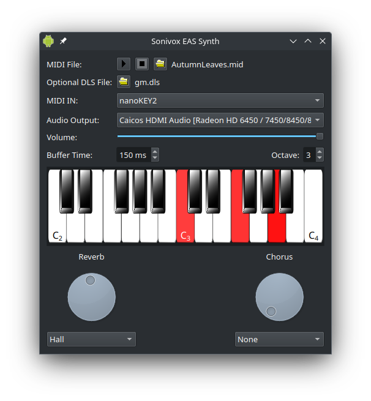

Multiplatform Sonivox EAS for Qt
================================

This project is a multiplatform MIDI Synth based on the Sonivox EAS Synthesizer published by Google on the Android Open Source Project.
It is a real time GM synthesizer without needing external soundfonts, using embedded samples instead. It consumes very little resources, so it may be indicated in projects for small embedded devices.
This repository is a fork of the older project [Linux-SonivoxEas](https://github.com/pedrolcl/Linux-SonivoxEas) which uses PulseAudio output and ALSA Sequencer MIDI input, so it is a Linux only application.
On the other hand, this multiplatform version uses Qt Multimedia audio output and Drumstick::RT MIDI input on all supported platforms.

The library uses Drumstick::RT MIDI input and Qt audio output. Complete compile-time dependencies are:
* Qt5 or Qt6, including QtMultimedia. http://www.qt.io/
* Drumstick 2.6, for Drumstick::RT MIDI input and the Drumstick::Widgets piano component. http://sourceforge.net/projects/drumstick/

Just to clarify the Drumstick dependency: this project requires Drumstick::RT, but Drumstick does not depend on this project at all. There is a Drumstick::RT backend that includes the Sonivox synth as well, but both projects are independent regarding this synthesizer.

The project directory contains:
* cmdlnsynth: Command line sample program using the synthesizer library
* guisynth: GUI sample program using the synthesizer library
* libsvoxeas: The synthesizer shared library, using Drumstick::RT for MIDI input and Qt Multimedia for audio output
* sonivox: The sonivox eas library, forked from the AOSP source files, as a git submodule. It is used as a fallback if the sonivox library external dependency is not found at configuration time.

Hacking
-------

Remember to use `git clone --recurse-submodules` when cloning the repository to populate the working copy with all the sources, including the submodule's.
If you forgot to do that, then you may need to do `git submodule update --init --recursive` afterwards.

Use your favorite IDE or text editor with the source files. My preference is QtCreator: https://www.qt.io/ide/
To build, test and debug you may also find QtCreator interesting. You may also use CMake (>= 3.9) to build the project.

Licenses
--------

Copyright (C) 2016-2023 Pedro López-Cabanillas.

This program is free software; you can redistribute it and/or modify
it under the terms of the GNU General Public License as published by
the Free Software Foundation; either version 3 of the License, or
(at your option) any later version.

This program is distributed in the hope that it will be useful,
but WITHOUT ANY WARRANTY; without even the implied warranty of
MERCHANTABILITY or FITNESS FOR A PARTICULAR PURPOSE.  See the
GNU General Public License for more details.

You should have received a copy of the GNU General Public License
along with this program. If not, see <http://www.gnu.org/licenses/>.

This project includes code from the Sonivox EAS synthesizer, Copyright Sonic Network Inc. 2006. 
Sonivox EAS belongs to the Android Open Source Project. It has been forked from the official repositories:

https://github.com/pedrolcl/sonivox

Licensed under the Apache License, Version 2.0 (the "License"); you may not use this file except in compliance with the License. 
You may obtain a copy of the License at http://www.apache.org/licenses/LICENSE-2.0

Unless required by applicable law or agreed to in writing, software distributed under the License is distributed on an "AS IS" BASIS, 
WITHOUT WARRANTIES OR CONDITIONS OF ANY KIND, either express or implied. See the License for the specific language governing 
permissions and limitations under the License.

The Android robot is reproduced or modified from work created and shared by Google and used according to terms described in the 
Creative Commons 3.0 Attribution License.
